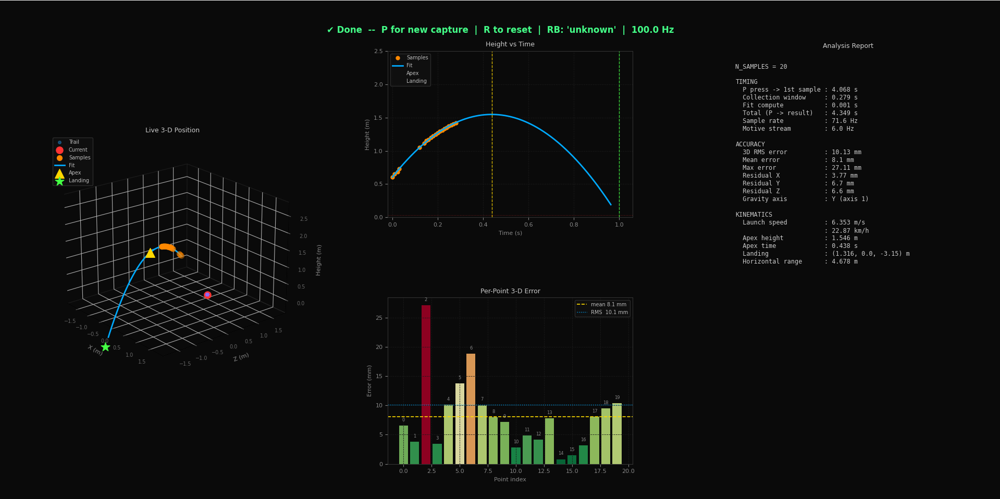

# OptiTrack Ball Tracker

Real-time 3D ball trajectory tracking and parabola fitting using OptiTrack motion capture, with no SDK required — raw UDP only.



---

## Overview

This tool connects directly to Motive via raw NatNet UDP packets, tracks a ball in 3D at full capture rate (100 Hz), and fits a physics-constrained parabolic trajectory to the collected points. Results including timing, accuracy, and kinematics are displayed live in a matplotlib window.

**No NatNet SDK or extra pip packages beyond NumPy, SciPy, and Matplotlib.**

---

## Features

- Live 3D position plot with trail, updated in real time
- Press **P** to instantly collect N samples and fit a parabola
- Animation pauses during collection so UDP runs at full Motive rate
- Auto-detects the gravity axis (Y-up or Z-up) from the data curvature
- Per-point 3D residual error bar chart
- Full timing analysis: P-press → first sample → fit complete
- Accuracy analysis: 3D RMS, per-axis residuals, mean/max error
- Kinematics: launch speed, apex height, predicted landing position
- Supports both **rigid body** tracking (5-marker ball) and **single unlabeled marker**
- Mouse-rotatable 3D plot (animation uses dirty-flag to avoid interfering with mouse drag)

---

## Requirements

```bash
pip install numpy scipy matplotlib
```

Python 3.8+ required. No OptiTrack SDK needed.

---

## Motive Setup

1. Open Motive and go to **View → Data Streaming**
2. Enable **Broadcast Frame Data**
3. Set **Transmission Type** to **Multicast**
4. Note the IP shown under **Local Interface** — this is your `SERVER_IP`
5. If tracking a rigid body: create a rigid body from your markers and name it `ball`

---

## Configuration

All tunable parameters are at the top of the script:

```python
SERVER_IP      = "10.156.84.112"   # IP of the PC running Motive
GRAVITY_AXIS   = 1                 # 1 = Y-up (default), 2 = Z-up
N_SAMPLES      = 20                # number of frames to collect per capture
TRACKING_MODE  = "rigid_body"      # "rigid_body" or "single_marker"

# Capture volume limits (metres)
X_LIM = (-1.5, 1.5)
Y_LIM = (0.0,  2.5)
Z_LIM = (-1.5, 1.5)
```

### Choosing N_SAMPLES

| Goal | Suggested value |
|---|---|
| Quick test / fast throw | 20–30 |
| Full arc (toss up and catch) | 80–150 |
| Best fit accuracy | 50+ |

At 100 Hz, 20 samples = 0.2 seconds of flight data.

### Tracking mode

| Mode | When to use |
|---|---|
| `"rigid_body"` | Ball defined as a rigid body in Motive (recommended — more robust) |
| `"single_marker"` | Ball is a single unlabeled reflective marker |

---

## Usage

```bash
python ball_tracker_rigibody.py
```

| Key | Action |
|---|---|
| **P** | Start collecting N_SAMPLES frames, then fit parabola |
| **R** | Reset — clear results and return to live view |
| **Q** | Quit |

**Workflow:**
1. Run the script — the 3D plot opens and shows the live ball position
2. Press **P**, then immediately throw or move the ball
3. The animation pauses, N frames are collected at full 100 Hz, then the fit runs
4. Results appear automatically — rotate the 3D plot with your mouse to inspect the trajectory
5. Press **P** again for a new capture, or **R** to clear

---

## Output

### Plot panels

| Panel | Contents |
|---|---|
| **3D (left)** | Live trail, collected sample points, fitted parabola arc, apex marker, predicted landing |
| **Height vs Time (top centre)** | Observed samples vs fitted parabola on the gravity axis |
| **Per-Point Error (bottom centre)** | Bar chart of 3D residual per sample, colour-coded green→red |
| **Analysis Report (right)** | Full timing, accuracy, and kinematics numbers |

### Analysis report fields

**Timing**
- `P press → 1st sample` — latency from keypress to first UDP frame received
- `Collection window` — time span of the N collected samples
- `Fit compute` — time SciPy took to solve the curve fit
- `Total (P → result)` — full end-to-end latency
- `Sample rate` — actual Hz of collected points (should match Motive stream rate)
- `Motive stream` — measured UDP frame rate

**Accuracy**
- `3D RMS error` — root mean square of 3D distance from each point to the fitted curve (mm)
- `Mean / Max error` — average and worst single-point error (mm)
- `Residuals X / Y / Z` — per-axis RMS fit residual (mm)
- `Gravity axis` — which axis was used for the -9.81 m/s² constraint (auto-detected)

**Kinematics**
- `Launch speed` — magnitude of initial velocity vector (m/s and km/h)
- `Apex height` — peak height on the gravity axis and time at apex
- `Landing` — predicted (x, y, z) when trajectory crosses floor (height = 0)
- `Horizontal range` — distance from launch to landing in the horizontal plane

---

## How it works

### Architecture

```
Motive (100 Hz UDP) ──► UDP thread ──► display buffer (live trail)
                              │
                         [P pressed]
                              │
                         collect N frames inline (no sleep, no GIL contention)
                              │
                         fit thread ──► scipy curve_fit ──► results
                              │
                         watchdog thread ──► resume matplotlib animation
```

The matplotlib animation is **paused** during collection and **resumed** automatically once the fit completes. This ensures the UDP thread gets full CPU time and collects frames at the true Motive rate.

### Parabola fit model

For each axis independently:

```
pos(t) = p0 + v0·t + ½·a·t²
```

The gravity axis has `a` fixed to `-9.81 m/s²`. The other two axes have `a = 0` (constant velocity horizontally). Initial position `p0` and velocity `v0` are the free parameters solved by `scipy.optimize.curve_fit`.

The gravity axis is **auto-detected** by fitting a free quadratic to all three axes and finding the one with the highest curvature. If it disagrees with `GRAVITY_AXIS` by more than 2×, it overrides with a warning printed to the terminal.

### NatNet packet parsing

The script parses NatNet v3 UDP packets directly without any SDK. Rigid body packets contain: `id (int32) + xyz (3×float32) + quaternion (4×float32) + error (float32) + params (int16)`. The `tracking_valid` flag is bit 0 of `params`.

---

## Troubleshooting

**`RB: 'unknown'` in status bar**
Motive hasn't sent a model description packet yet. Wait 2–3 seconds or restart Motive streaming. If the rigid body name is not `ball`, change the matching line in `udp_listener()`.

**Large Y residual (hundreds of mm), small X and Z**
Your system is Z-up, not Y-up. Set `GRAVITY_AXIS = 2`. The auto-detector will also catch this and print a warning.

**Sample rate much lower than Motive stream rate**
Make sure the animation is actually pausing during collection (check terminal for `Animation PAUSED`). If it still drops, increase `PLOT_INTERVAL_MS` or reduce `TRAIL_LEN`.

**Cannot rotate 3D plot**
The dirty-flag animation update should allow rotation. If it still doesn't work, click once on the 3D axes area to give it focus before dragging.

**Bind failed on port 1511**
Another application is already listening on that port, or you need to run with elevated permissions. Try changing `CLIENT_IP` from `"0.0.0.0"` to your machine's actual local IP.

---

## License

MIT